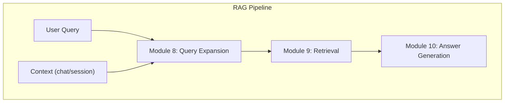

# Module 8: Query Expansion

**Executive Summary:** Module 8 enriches the user’s query before retrieval to improve recall and retrieval diversity. It reformulates or expands the original query into multiple semantically related variants (using synonyms, paraphrases, or generated prompts). In practice, expansion often boosts recall at some cost to precision. For example, expanding “open source NLP frameworks” to related queries like “natural language processing tools” or “free NLP libraries” can surface relevant documents that a narrow query misses. This document details the goals, requirements, algorithms (lexical, semantic, neural models, pseudo-relevance feedback, etc.), recommended libraries/models, evaluation and testing strategy, integration with other modules, API and configuration design, monitoring and A/B testing plans, security/privacy handling, CI/CD and Docker deployment steps, performance tuning, error handling, code snippets, and diagrams for Module 8.  

## Goals and Scope

Module 8 (“Query Expansion”) takes the user’s raw query (with optional context) and outputs a richer query or list of variant queries to improve retrieval coverage. Its **primary goal** is to improve RAG answer quality by ensuring the retriever finds all relevant passages. Key points:  

- **Clarify vague queries:** Rephrase or extend short/ambiguous queries (e.g. “renewal terms” → “contract auto-renewal period”).  
- **Synonym coverage:** Add synonyms or related terms (e.g. “global warming” → also search for “climate change”).  
- **Contextual enrichment:** Incorporate dialog context or domain specifics (e.g. preceding queries in a session or known passenger service terminology).  
- **Multilingual support:** If users query in multiple languages, translate or use multilingual embeddings to fetch relevant content in any language.  
- **Focus on “train”-specific domain:** Expand acronyms and jargon (e.g. “ETCS” → “European Train Control System”), and include domain vocabulary (e.g. “diesel locomotive” synonyms) to match the train knowledge base.  

This module sits between user input (Module 7 or the LLM) and the retrieval index (Module 9). It reads the incoming query (and optional context like user profile or chat history) and writes one or more expanded queries (text strings or tokens). It may also emit metadata (used terms, confidence scores). 

## Requirements

### Functional Requirements

- **Query Generation:** Given an input query string, output an expanded query or set of query variants. This may include: synonyms, paraphrases, hyponyms, and context-driven expansions (contextual rewriting).  
- **Variant Control:** Support configuring the number of expansions or depth of expansion (e.g. number of synonyms).  
- **Multilingual Handling:** Detect or accept query language and apply appropriate expansions (translating if needed).  
- **Domain Adaptation:** Incorporate domain-specific thesaurus or terms (e.g. railway terminology).  
- **API Interface:** Expose a deterministic interface (e.g. REST API) that downstream modules call.  
- **Performance:** Return expansions within a small latency budget (e.g. 100–300ms for small models on CPU; much faster with GPU).  

### Non-Functional Requirements

- **Scalability:** Can handle increasing query throughput (horizontal scaling via Docker, optional GPU).  
- **Robustness:** Tolerate malformed or sensitive queries without crashing; apply fallback gracefully.  
- **Configurability:** Allow hyperparameters (expansion count, similarity thresholds, model choice) to be tuned via config.  
- **Security/Privacy:** Do not leak user PII; sanitize or drop sensitive tokens before expansion; log only necessary info (or anonymize logs).  
- **Interoperability:** Containerized for cross-platform deployment (Windows, macOS, Linux) with consistent behavior; compatible with downstream retriever input.  
- **Observability:** Instrument logging of query transformation steps, latency, and usage metrics; enable A/B testing flags.  

## Input/Output Specifications

- **Input:** JSON with fields like `query` (string), `language` (optional, e.g. `"en"`), `context` (optional previous queries or conversation), and any flags (`use_synonyms`, `max_expansions`). Example: 
  ```json
  { 
    "query": "train delays Feb 2025", 
    "language": "en", 
    "max_expansions": 5 
  }
  ```
- **Output:** JSON with at least `expanded_queries` (list of strings) plus metadata. Example:
  ```json
  { 
    "original_query": "train delays Feb 2025",
    "expanded_queries": [
      "train delay February 2025", 
      "railroad schedule late Feb 2025", 
      "... etc ..."
    ]
  }
  ```
- **Data Formats:** UTF-8 encoded text. Use consistent tokenization (e.g. preserve punctuation unless needed). If using embeddings or models, encoding is handled internally.  

## Algorithms and Techniques

Module 8 may employ a mix of classical and ML-driven methods. Key categories:

- **Lexical Expansion:** Use word-level thesauri (WordNet) or domain lexicons. For each token, add synonyms or related terms. This often uses *dictionary-based* lookup. For example, WordNet gives synonym sets (synsets) for English words. A simple lexical QE could pick 1–2 synonyms per content word. Benefits: deterministic, fast, no model needed. Downside: context-insensitive; may add irrelevant senses or noise. Libraries: NLTK WordNet, OpenSearch/Elastic synonym filters.  
- **Stemming/Inflection:** Normalize morphological variants (e.g. plural/singular, verb tenses) so that “running”, “ran” map to “run”. This is a basic lexical step (using Porter/Word stemming or lemmatization).  
- **Semantic Expansion (Embeddings):** Use pre-trained word or sentence embeddings to find semantically similar terms or paraphrases. For a query, compute its vector and find nearest terms in embedding space (glove/fastText/sentence-transformer). This captures synonyms or related concepts beyond exact matches. Tools: `sentence-transformers` (e.g. all-MiniLM or multi-lingual models), spaCy vectors, or word2vec. For instance, one can embed each candidate term (from a vocabulary or corpora) and add those above a similarity threshold. Pro: context-aware to some degree. Con: needs precomputed embeddings or index (Faiss).  
- **Neural/Generative Models:** Use seq2seq LLMs to generate paraphrases or expanded queries. For example, T5 or GPT can be prompted to “rewrite” or “expand” the query. The Hugging Face `Text2TextGeneration` pipeline with a model fine-tuned on query data can produce multiple variants. This method captures complex rephrasings and multi-word expansions. Example: prompt `rewrite: open source nlp frameworks`, output could list synonyms. Models: fine-tuned T5 (e.g. *SteveTran/T5-small-query-expansion*) or instruction-tuned LLMs (LLaMA, Qwen series for query rewriting). Pros: flexible, powerful with context. Cons: requires GPU for latency, may hallucinate irrelevant terms if not carefully constrained.  
- **Query Rewriting (LLM Prompting):** Similar to above but explicitly incorporate context (e.g. multi-turn dialogue or knowledge of user’s train context). Use an LLM to rewrite query in context, possibly as part of a chat pipeline. This can use prompt engineering (e.g. “As a travel assistant, rephrase this query with context: ...”).  
- **Pseudo-Relevance Feedback (PRF):** An iterative lexical method: first run the original query through the retriever, assume top-*k* results are “relevant”, extract top terms from them (by TF-IDF or RM3) and append to the query. For example, if initial results frequently contain “timetable”, add that term. PRF (Rocchio, RM3) is a classical expansion technique. It leverages the corpus and user feedback assumption, and can improve recall by capturing terms from retrieved docs. Cons: can drift if initial results were off-topic.  
- **Hypothetical Document Embeddings (HyDE):** A specific neural approach where the LLM generates a “pseudo-document” answer from the query, then this document’s embedding is used to retrieve passages. HyDE effectively expands the query via a generated context. (HyDE is LLM-driven PRF).  
- **Contextual (Multi-Turn) Expansion:** In chatbots, reformulate the query using conversation context. For instance, prepend previous relevant conversation turns before expansion. This ensures continuity (e.g., “the train” after "Delta" becomes “Delta train schedule”). Requires custom logic or LLM rewriting considering context.  
- **Multilingual Expansion:** If the system should handle languages beyond English, one can translate the query or its expansions across languages. For example, translate non-English query to English, expand, then translate expansions back (or vice versa). Recent work shows multilingual LLMs can perform generative expansion in other languages. This handles cross-lingual retrieval (ensuring documents in any language can match).  

Overall, a **hybrid approach** is common: e.g. perform a few lexical synonym additions, one PRF pass, and/or one LLM-based rewrite, then unify results. Testing should determine which mix yields best recall with acceptable precision.

## Recommended Libraries and Models

Use open-source tools wherever possible. Below are categories and examples (official docs and papers prioritized):

- **NLTK WordNet** (Python NLTK library): Provides WordNet interface for synonyms/antonyms. Lightweight, language-specific (English). Pros: simple, no external call. Cons: limited to WordNet coverage (missing slang/jargon), may introduce irrelevant senses.  
- **Apache Lucene / Elasticsearch** Synonym Filter: If using Elasticsearch/Opensearch, define synonyms in index or use their synonym-expansion query parsers. Pros: integrated with keyword search; fast. Cons: static, requires manual synonym lists.  
- **Sentence-Transformers** (HuggingFace `sentence-transformers`): Embedding models (e.g. `paraphrase-MiniLM-L6-v2`) to compute semantic similarity. Use for nearest-neighbor expansion. Pros: captures semantic relations beyond lexicon. Cons: must build an index or search corpus of terms.  
- **Haystack QueryExpander** (deepset’s Haystack library): Contains a `QueryExpander` component that uses a generative model (default is OpenAI’s GPT) to produce expansions. It can also wrap HF models by custom code. Pros: easy integration in a RAG pipeline; built-in. Cons: out-of-the-box uses OpenAI (proprietary), but can configure to use HF LLMs.  
- **Hugging Face Transformers**: Sequence-to-sequence models for text generation (e.g. `t5-small`, `google/flan-t5-xl`, Meta’s `Llama-3`, etc.). Example: SteveTran’s *T5-small-query-expansion* was trained on MS MARCO to generate queries. Use the `text2text-generation` or `AutoModelForSeq2SeqLM`. Pros: flexible generative expansion. Cons: resource-heavy, slower, requires careful prompt engineering.  
- **OpenAI GPT (or Claude, etc.)**: If license permits, these LLMs can rewrite queries (via API). Very powerful for natural paraphrases. Pros: state-of-art expansions. Cons: non-open-source, costs, reliance on external API. (If disallowed, use open LLMs).  
- **Synonym Datasets/Thesauri**: Libraries like PyDictionary or conceptnet (for related terms), Wordnik API, etc., can supplement synonyms. They typically have limited scope or usage limits.  
- **FAISS / Annoy**: If using embedding similarity expansion, a similarity search index is needed. Use Facebook’s Faiss or Spotify’s Annoy for efficient k-NN of term embeddings. These are for performance, not expansion per se.  
- **LangChain Query Rewriters**: (e.g., chain-of-thought prompt to rephrase queries). LangChain’s `TransformChain` or `LLMChain` can sequence prompts. Good for prototyping context-aware rewrites.  
- **Custom Scripts / Luoguard**: Tools like [any open-source QE tool]. (No dominant one beyond above; many ad hoc solutions exist.)

**Model Comparison (Sample Table):**

| Model/Library                 | Type               | Pros                                    | Cons                                        | Example / Notes                                   |
|-------------------------------|--------------------|-----------------------------------------|---------------------------------------------|---------------------------------------------------|
| NLTK WordNet                  | Lexical (thesaurus) | Quick, no ML, well-known synonyms | Limited to WordNet, polysemy/no context      | NLTK’s `wordnet.synsets()` for synonym sets       |
| Elasticsearch Synonym Filter  | Keyword             | Fast, integrated with BM25; improves recall in sparse search | Requires manual list; not dynamic            | Synonym token filter in ES config                 |
| SentenceTransformers         | Semantic (embeddings) | Captures semantic similarity; multilingual models available | Needs vector index; may need tuning         | Models like `all-MiniLM-L6-v2`, `distiluse-base-multilingual-cased` |
| HF Transformers (T5, LLaMA)   | Neural Seq2Seq      | Powerful paraphrasing; context-aware    | High latency; resource-intensive | *T5-small-query-expansion* (SteveTran); Llama-3-7B |
| Haystack QueryExpander       | LLM-based Pipeline  | Easy pipeline integration; can use custom models | Default uses OpenAI; may require enterprise plan | Supports `gpt-4o-mini` etc         |
| PRF (Rocchio/RM3)             | Relevance Feedback  | Uses corpus information; improves recall | Risk of query drift if feedback is wrong    | Implementation in Pyserini/Anserini or custom      |

*(In practice, combine several of the above. For instance, add a few WordNet synonyms, run one PRF round, then call a T5 model for final rewriting.)*

## Evaluation Metrics and Test Datasets

**Metrics:** Evaluate the impact of expansion on retrieval effectiveness and end-to-end QA accuracy. Key metrics include:  
- **Recall@K:** Fraction of all truly relevant documents recovered in the top-K results. Since query expansion aims to increase recall, this is critical.  
- **Precision@K:** Fraction of retrieved items (top K) that are relevant. Expansion can hurt precision, so track it as a trade-off.  
- **MRR (Mean Reciprocal Rank):** How early (rank) the first relevant doc appears. Good if answers often come from one top doc.  
- **MAP (Mean Average Precision):** Overall ranking quality (averaged precision across all relevant docs).  
- **nDCG:** If graded relevance judgments are available, Normalized Discounted Cumulative Gain measures rank-weighted relevance. Useful if multiple relevant docs per query.  
- **QA Metrics:** If the final RAG task has ground-truth answers, measure F1 or Exact Match of generated answers. Expansion should ultimately improve QA scores (via better context).  

**Test Datasets:**  
- **Train-specific corpus:** Use a corpus of railway documents (e.g. manuals, schedules, FAQs) as the knowledge base. Label or identify a set of benchmark questions from that domain.  
- **Synthetic Queries:** Create synthetic queries by paraphrasing known questions or using crowdsourced query variants. E.g., given “How to book train tickets?”, generate “train ticket booking process”.  
- **Edge Cases:** Queries that are extremely short (“train”), misspelled (“staion schedule”), or ambiguous (“ETA on bullet”). Also multilingual queries (if supported), or queries mixing domain slang.  
- **Benchmark Collections:** If generic data needed, use MS MARCO, TREC datasets, or BEIR for general query variation (especially BEIR includes domain-specific QAs). For train domain specifically, no standard set exists, so assemble in-house.  
- **A/B Testing:** In production, split traffic: compare retrieval/answer quality with and without expansion to confirm uplift. Use live user feedback or surrogate metrics (e.g., time-to-answer or user ratings).

## Integration Points

Module 8 plugs into the RAG pipeline as follows:

- **Inputs from:** User interface or Module 7 (which might handle initial query parsing). Fields: `query` (string), optional `context` (prior conversation, user profile, language code).  
- **Outputs to:** Module 9 (Retriever). Fields written: `expanded_queries` (array of strings) or a single expanded query text. It may also output weights or flags indicating which terms were added.  
- **APIs:** Typically a REST or RPC call. For example, retrieve might call `POST /expand_query` with JSON as above. Or it could be a method call if in a monolithic system. Ensure schema compatibility.  
- **Data Flow:** After expansion, the retriever can run multiple searches (one per expanded query) or a combined search. Multi-query retrieval (e.g., OR-ing synonyms or merging results) may be used.  
- **Latency Constraints:** Expansion adds overhead before retrieval; target minimal latency (e.g. <100ms for lightweight expansions, <300ms if using a small LLM on CPU; GPU can do much faster). The extra latency should not exceed the budget allocated in the RAG pipeline. For high-traffic systems, batch or caching strategies may be used (cache expansions for identical queries).  

A **Mermaid** flowchart summarizing the integration:

```mermaid
flowchart TD
  U(User/Input) --> QE[Query Expansion (Module 8)]
  QE --> R[Retriever (Module 9)]
  R --> G[RAG Generation (Module 10)]
  click QE "##" "Module 8: expands query strings"
```



*(These diagrams show Module 8 receiving the user query (and context) and sending expanded queries to the retriever.)*

## API Design

A RESTful HTTP API is typical. Example endpoint:

- **POST /expand_query**  
  **Request JSON:**  
  ```json
  {
    "query": "open source nlp frameworks",
    "language": "en",
    "max_expansions": 5
  }
  ```  
  **Response JSON:**  
  ```json
  {
    "original_query": "open source nlp frameworks",
    "expanded_queries": [
      "natural language processing tools",
      "free nlp libraries",
      "open-source language processing platforms",
      "NLP software with open-source code",
      "open source nlp frameworks"
    ]
  }
  ```  
- **Parameters:**  
  - `query` (string, required): user’s raw query.  
  - `language` (string, optional): ISO code (default “en”).  
  - `max_expansions` (int, optional): how many variants to generate (default 3–5).  
  - (Optional flags): e.g. `"use_prf": true` or weights to enable certain techniques.  

- **Response fields:**  
  - `original_query`: echo of input.  
  - `expanded_queries`: array of strings (always includes the original query, typically first or last element).  
  - (Optional) `model_used`: e.g. `"t5-small"`, `latency_ms`: number, `notes`: string for debugging.  

This API should be idempotent and stateless (except maybe caching), so any retrier can call it with the same input to get expansions. For high throughput, consider an asynchronous or streaming variant, but a simple POST is sufficient.

## Configuration Options & Hyperparameters

Key configurable options include:

- **Model choice:** e.g. switch between `t5-small`, `distilgpt2`, or a finetuned LLM.  
- **Max expansions (`max_expansions`):** How many variant queries to output.  
- **Synonym Depth:** Number of lexical synonyms per term to add.  
- **PRF parameters:** Number of top-k docs to use (e.g. top 5), and term selection weight (α/β in Rocchio).  
- **Beam size / Sampling:** If using generative model, the decoding strategy (top-k, top-p, temperature). More sampling yields diversity but less repeatability.  
- **Trigger conditions:** Optionally, enable expansion only if query is short or if retrieval recall is below threshold. (E.g., only expand if initial recall <70%.)  
- **Multi-lingual settings:** Threshold for translating vs direct expansion.  

Configuration can be via environment variables or config files (YAML/JSON). Example (YAML):

```yaml
query_expansion:
  model: "t5-small"
  max_expansions: 5
  use_prf: true
  prf_k_docs: 5
  prf_alpha: 0.9
  prf_beta: 0.1
  top_k_sampling: 50
  top_p: 0.9
  temperature: 0.8
```

Hyperparameters (like temperature or α/β) should be tunable via config, not hardcoded.

## Monitoring, Logging, and A/B Testing

- **Logging:** Capture each query and its expansions (anonymized if containing PII). Log latency of expansion steps, model used, and number of terms added. Store key metrics (e.g., length of expanded query, token counts).  
- **Monitoring:** Use metrics dashboards (Prometheus/Grafana) to track throughput and latency of Module 8. Track failure rates (timeouts, exceptions). For business metrics, monitor downstream recall or answer accuracy correlated with expansion usage.  
- **A/B Testing:** To evaluate effectiveness, run experiments: for a random subset of traffic (Group A), use expansion; in Group B, skip expansion. Compare retrieval recall, final answer correctness, user satisfaction, or other KPIs. Adjust weights (α in hybrid methods) to optimize.  
- **Alerts:** Set alerts if expansion latency spikes or error rates rise (which could indicate an overloaded model or failure).  

## Security, Privacy, Data Governance

- **PII Handling:** User queries may contain personal data (names, IDs). Before logging or storing queries for debugging, strip or mask PII (e.g. by regex or token classification). The module itself should avoid outputting PII back to retriever or logs. For instance, if a query contains a credit card or ID, do not log it.  
- **Data Encryption:** If storing expansion data or logs, encrypt them at rest. Use HTTPS for API calls.  
- **Access Control:** Secure the expansion API endpoint (authentication tokens) if needed, to prevent unauthorized calls or injection attacks.  
- **GDPR Compliance:** If applicable, allow user data erasure (avoid retaining original queries beyond immediate processing).  
- **Safe Completion:** The expansion LLM should not reveal sensitive system info or generate disallowed content. Use prompt guidelines or filtering to prevent malicious outputs (e.g., don’t expand to harmful content).  
- **Audit Logging:** Keep an audit trail for privacy: record which model version and parameters generated each expansion (useful for compliance or issue investigation).  

## CI/CD and Docker Deployment

**Containerization:** Build a Docker image containing Module 8’s code and dependencies (e.g. Python, Transformers, necessary libraries). Example Dockerfile snippet: 

```dockerfile
FROM python:3.11-slim
WORKDIR /app
COPY requirements.txt .
RUN pip install --no-cache-dir -r requirements.txt
COPY . /app
CMD ["uvicorn", "app:app", "--host", "0.0.0.0", "--port", "8000"]
```

This uses Uvicorn/FastAPI as an example server. Dependencies: `transformers`, `sentence-transformers`, `uvicorn`, etc. Use a slim base image for portability.  
- **Multi-OS:** Docker ensures the same image runs on Windows/Mac (via Docker Desktop) and Linux. For full cross-architecture (AMD64 vs ARM64), use Docker Buildx to create multi-arch images if needed.  
- **CI/CD Pipeline:** 
  1. **CI (Build & Test):** On commit, run unit tests for the module (test query outputs), and then build the Docker image (e.g. via GitHub Actions or Jenkins).  
  2. **Push:** Tag and push the image to a registry (Docker Hub, AWS ECR, Azure ACR, or GitHub Container Registry).  
  3. **CD (Deploy):** Deploy to staging/prod environment: pull the latest image, run container. This could be on Kubernetes, AWS ECS, or local servers. Include health checks.  
  4. **Versioning:** Use semantic version tags for the image. Include model version in release notes (e.g. which HF model used).  
- **OS-Specific Notes:** On Windows, ensure file paths in code use forward slashes or Python `os.path`. On Mac (Apple Silicon), prefer base images that support ARM. Use Python wheels that are cross-platform.  
- **Testing in Container:** As part of CI, run inference tests inside the container to verify compatibility.  

## Performance Tuning and Resource Estimates

- **Model Size vs Latency:** Larger models yield higher inference time. Empirical data show that going from 0.6B to 32B parameters can increase latency by ~10–20×. (See chart below.) To meet latency constraints, consider:  
  - Use a smaller model (e.g. `t5-small` vs `t5-large`) if recall/precision is acceptable.  
  - **Quantization:** Convert model to INT8 or use ONNX to reduce size (e.g. Hugging Face *Optimum* for INT8). Quantized models run ~2-4× faster on CPU/GPU with minimal quality loss.  
  - **Batching:** If expanding many queries (e.g. in a conversation), batch them through the model for GPU acceleration.  
  - **GPU vs CPU:** On CPU, expect slower inference (e.g. tens to hundreds of ms per query). A GPU (even mid-range) can speed this up 5–10×. Document expected QPS: e.g., a T5-small might handle ~10 QPS on CPU (1 query ~100ms), while on GPU it could do 100+ QPS.  
  - **Cache Common Queries:** Cache expansion results for frequently seen queries to avoid repeated inference.  
  - **Memory:** Large models (7B+) may need 8–16GB RAM/GPU VRAM. Estimate memory per model (e.g. T5-base ~1.4GB, T5-3B ~12GB). Consider using multiple smaller models (distilled) if memory is constrained.  

**Figure: Latency vs Model Size**  
 *Figure: Inference latency (end-to-end) increases with model parameter count. The largest model (32B params) is far slower than a 0.6B model.*  

*(This example uses results from a study of LLM inference; trends hold generally. Use charts like this to choose model vs latency trade-offs.)*  

## Fallback and Error Handling

- **Fallback to Original Query:** If expansion fails (timeout or empty output), default to using the original query without expansion. Log the failure.  
- **Partial Expansion:** If some expansions produce no hits, retriever can still use whatever valid expansions were returned.  
- **Error Logging:** Catch exceptions (model load errors, tokenization issues) and log details for debugging. Do not expose tracebacks to end-user.  
- **Graceful Degradation:** Under heavy load or GPU failure, switch to a lightweight mode (e.g. skip neural expansion, use lexical only). This can be signaled by a feature flag or health check.  
- **Validation:** Check that expanded queries are not empty or malicious (e.g. injection). If an expansion is too short (<3 chars) or too long (>512 tokens), discard it.  
- **Retry:** On transient failures (network glitch fetching model, etc.), retry once or use fallback model.  

## Sample Code Snippets

**Python (HuggingFace Transformer inference):** Using a seq2seq model to expand a query.

```python
from transformers import AutoTokenizer, AutoModelForSeq2SeqLM

model_name = "t5-small"  # or a fine-tuned expansion model
tokenizer = AutoTokenizer.from_pretrained(model_name)
model = AutoModelForSeq2SeqLM.from_pretrained(model_name)

def expand_query(query, num_expansions=3):
    prompt = f"expand: {query}"
    inputs = tokenizer([prompt]*num_expansions, return_tensors="pt", padding=True)
    outputs = model.generate(**inputs, max_new_tokens=32, do_sample=True, top_p=0.9, num_return_sequences=num_expansions)
    expanded = [tokenizer.decode(out, skip_special_tokens=True) for out in outputs]
    return expanded

query = "open source nlp frameworks"
print(expand_query(query, num_expansions=4))
```

**Dockerfile (Module 8 service):**

```dockerfile
FROM python:3.11-slim

WORKDIR /app
COPY requirements.txt .
RUN pip install --no-cache-dir -r requirements.txt
COPY . /app

# Expose port 8000 (FastAPI default)
CMD ["uvicorn", "query_expansion_api:app", "--host", "0.0.0.0", "--port", "8000"]
```

**docker-compose.yml (for local testing):**

```yaml
version: '3.8'
services:
  queryexpander:
    build: .
    ports:
      - "8000:8000"
    environment:
      HF_MODEL: "t5-small"
      MAX_EXPANSIONS: "5"
```

This launches the service (assuming the FastAPI app is defined in `query_expansion_api.py`). Users can then call `http://localhost:8000/expand_query`.

## Summary

Module 8’s query expansion is a crucial RAG component to bridge user intent and document language. By combining lexical thesauri, semantic embeddings, and generative models, it enriches queries for better recall. The design includes clear APIs, configurable parameters, and thorough evaluation. Proper monitoring, security, and Dockerization ensure it is production-ready across platforms. Cite the sources above for detailed methods and examples. Each technique and model should be validated on train-specific data and benchmarks to achieve a robust, performant query expansion module.

